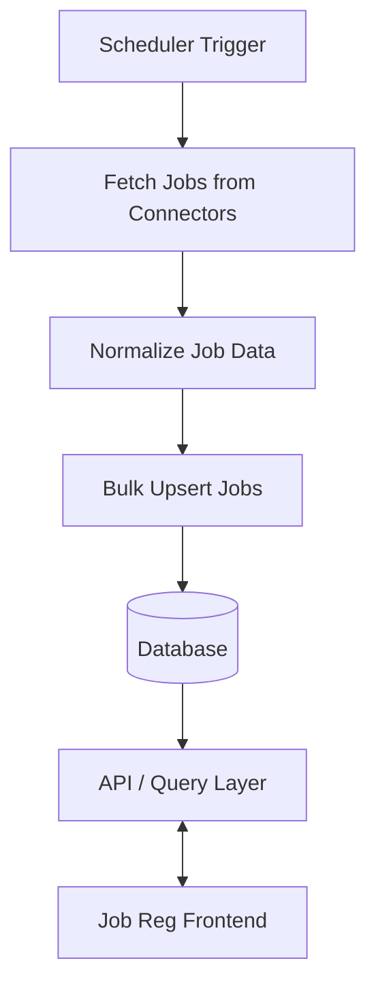

# Architecture

## Data Flow Diagram

## Overview
This service is a backend job registry that periodically fetches job listings from multiple external sources, normalizes them, and persists them for querying. Primary concerns are connector integration, data normalization, deduplication/upsert, and scheduled sync.

## High-level components
- Scheduler
  - Periodic task runner using cron (see src/scheduler/sync.scheduler.ts).
  - Triggers connector fetch + normalization + bulk upsert.
- Connectors
  - Encapsulate source-specific fetching and normalization logic (`src/connectors/*`).
  - Each connector exposes `fetchJobs()` and `normalize()` (contract implied by usage).
- Persistence
  - Repository layer handles upsert and query operations (e.g., `src/db/job.repository.ts`).
  - Backing store: any durable DB (Postgres/MariaDB/MongoDB). Schema should support idempotent upsert and indexing for queries.
- API (if present)
  - Read endpoints to query normalized job data, filters, paging, and metadata.
- Utilities
  - Logging, error handling, and configuration (env-driven).

## Data flow
1. Scheduler cron job triggers (every minute in current config).
2. For each registered connector:
   - Call `fetchJobs()` to retrieve raw items.
   - Call `normalize(raw)` to map to canonical Job DTO.
   - Call repository `upsertJobsBulk(normalized)` to persist/deduplicate.
3. Errors are logged per-connector; other connectors continue.

## Reliability & Scaling
- Concurrency: connectors run in parallel (Promise.all). Ensure connectors are rate-limited and fault-tolerant.
- Idempotency: upsert operations must deduplicate by stable key (source + sourceId or fingerprint).
- Backpressure: bulk operations should be batched to avoid DB overload.
- Retries: consider retry/backoff for transient network/DB failures.

## Extensibility
- Add new connector by implementing `fetchJobs()` and `normalize()` and registering it in connectors index.
- Repository implementations can be swapped (SQL/NoSQL) behind the repository interface.

## Security & Configuration
- Secrets (API keys, DB credentials) via environment variables or secret manager.
- Validate and sanitize connector input to prevent injection.
- Monitor and alert on sync failures and abnormal durations.

## File map (examples)
- src/scheduler/sync.scheduler.ts — cron orchestration
- src/connectors/* — connector implementations
- src/db/job.repository.ts — persistence/upsert logic
- src/models/* — DTOs and types

## Notes
- Current schedule is "*/1 * * * *" (every minute). Adjust frequency according to rate limits and resource usage.
- Prefer schema and index design that supports efficient de-duplication and queries.